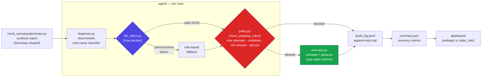

# Reclaim

**Razorpay Buildathon — Track 3: AI Revenue Recovery**

**Live demo:** https://huggingface.co/spaces/Hersheys2615/Reclaim-Agent
(static export of the dashboard — see [Option C](#viewing-results) below for
how it's built and how to run the full interactive version locally)

An agent that finds revenue slipping away — failed payments, abandoned
checkouts, overdue B2B invoices, failed UPI Autopay/eNACH mandates — diagnoses
*why* each one happened, picks a bounded recovery action, executes it, and
reports how much money it actually recovered across a batch, with an audit
trail for every decision.

## What it solves

Revenue loss at a merchant rarely happens in one clean step: a card expires,
a gateway times out, a customer bounces off checkout, an invoice goes
unpaid. Handling each of these well requires diagnosing the specific cause
and picking a *different* recovery action per cause — not a single generic
"send a reminder" script. This agent closes that loop end to end:

`detect → diagnose root cause → pick a bounded intervention → execute → measure`

## Architecture



Two independent gates sit between "the LLM had an idea" and "money moves": if
Groq's output fails schema validation, `llm_client.py` itself falls back to
deterministic rules before anything downstream sees it; then *every*
decision — LLM or fallback — still has to clear `policy.py`'s stopping
rules before `executor.py` acts on it. The model proposes, code disposes.

```
mock_razorpay/    synthetic batch generator, Razorpay-shaped data models
                  (Payment/Order/Invoice/Mandate objects, real Razorpay
                  error codes like BAD_REQUEST_ERROR, CARD_EXPIRED, ...)

agent/
  diagnose.py     deterministic root-cause classifier (error code / idle
                  time / days-overdue -> root cause + confidence)
  llm_client.py   LLM call (Groq, free tier): given the diagnosis, picks ONE
                  intervention from a fixed enum and drafts the customer
                  message. Falls back to a rule-based chooser if no API key
                  is set.
  policy.py       the bounded action space + stopping rules: max attempts,
                  cooldowns, minimum amount threshold, do-not-contact
  executor.py     state machine (open -> attempted -> recovered / failed /
                  escalated / skipped) + append-only audit log

run_batch.py      orchestrates the whole pipeline over a synthetic batch
dashboard/        zero-dependency static HTML report (no server needed)
webapp/           interactive FastAPI + JS dashboard (search/filter/sort,
                  case drill-down audit trail, in-browser "run new batch")
tests/            pytest suite for diagnosis, policy gates, executor
```

### Why mocked Razorpay data

This was built without a live Razorpay merchant account, so `mock_razorpay/`
generates synthetic cases shaped exactly like real Razorpay API objects
(amounts in paise, real error codes from
[razorpay.com/docs/api/errors](https://razorpay.com/docs/api/errors/), real
field names). The rest of the pipeline treats this exactly like real webhook
data — swapping `mock_razorpay/generator.py` for real Razorpay API calls
would require no changes downstream.

### Where AI is used, and where it deliberately isn't

- **Rule-based**: root-cause classification (`diagnose.py`) and the
  stopping-rule gate (`policy.py`) are plain deterministic code. These are
  safety-critical and auditable by design — an LLM should not be the thing
  deciding whether a customer gets contacted a 4th time.
- **LLM (Groq, free tier)**: given the diagnosis, decides *which* bounded
  intervention to take and drafts the actual customer-facing message (in
  Hinglish if the customer prefers it). This is where judgment calls and
  natural language actually help. The model's output is JSON, validated
  against a fixed intervention enum — if it proposes anything outside that
  enum, or the call fails, the system falls back to a deterministic
  rule-based decision rather than executing an unvalidated action.
- Every proposed action still passes through `policy.check_stopping_rules`
  **after** the LLM decides — the model proposes, code disposes. That's
  what makes every money action bounded and gated.

## Bounded action set

```
instant_retry, retry_with_delay, request_new_payment_method,
send_checkout_nudge, send_mandate_retry_link, send_receivable_reminder,
escalate_to_human, no_action
```

## Stopping rules (audit-visible, in `agent/policy.py`)

- Max automated attempts per category (2–4) before forced escalation
- Per-intervention cooldown (0–72h) between attempts on the same case
- Minimum amount threshold (₹200) below which we don't auto-recover
- `do_not_contact` customers only ever get `no_action`, never contacted

## Results on a sample batch (seed 42, n=80, rule-based fallback — no API key)

```
Total at risk:      ₹9,38,385
Total recovered:    ₹6,44,917
Recovery rate:      68.7%

By category:
  failed_payment       81.2% recovered  (39 cases, ₹2,14,968 at risk)
  overdue_receivable   71.8% recovered  (11 cases, ₹5,50,444 at risk)
  failed_mandate       90.4% recovered  ( 9 cases, ₹  51,992 at risk)
  abandoned_checkout   23.1% recovered  (21 cases, ₹1,20,981 at risk)
```

**Honesty note on these numbers**: success/failure per attempt is simulated
via a per-intervention success-rate table in `agent/executor.py`
(`simulate_outcome`), not a live payment gateway — there's no way to measure
a *real* recovery rate without a live merchant account. What these numbers
do demonstrate honestly: the diagnosis routes each case to a plausible
intervention, the stopping rules actually cap retries and respect
opt-outs (see `status_breakdown.escalated`/`skipped` above — these aren't
zero), and the pipeline runs deterministically end to end from raw event to
audited dollar amount. Swap `simulate_outcome` for a real Razorpay
retry/webhook response and the rest of the pipeline is unchanged.

## Running it

```bash
python3 -m venv .venv && source .venv/bin/activate
pip install -r requirements.txt

# Without an API key: falls back to deterministic rule-based decisions
python3 run_batch.py --n 80 --seed 42 --out sample_output

# With Groq-powered diagnosis-to-action decisions (free API key from console.groq.com):
export GROQ_API_KEY=gsk_...
python3 run_batch.py --n 80 --seed 42 --out sample_output

# Run tests
python3 -m pytest tests/ -q
```

### Viewing results

**Option A — interactive dashboard (recommended for the demo):**

```bash
uvicorn webapp.main:app --reload
# then open http://localhost:8000
```

A single-page dashboard: stat cards, per-category recovery bars, a status
breakdown, and a searchable/filterable/sortable case table. Click any case
to open its full audit trail — every diagnosis → decision → gate → outcome
step, including the LLM's drafted customer message and whether the decision
came from Groq or the rule-based fallback. A "Run new batch" control in the
header re-runs the pipeline with a different seed/size and reloads the view
live, without a page refresh — useful on camera to prove this isn't a canned
screenshot. It reads/writes the same `sample_output/` files as the CLI.

**Option B — static report, zero dependencies:**

```bash
python3 dashboard/render.py --data sample_output --out sample_output/dashboard.html
# then open sample_output/dashboard.html directly in a browser, no server needed
```

**Option C — static export of the full interactive dashboard (for free static
hosting, e.g. Hugging Face Static Spaces or GitHub Pages):**

```bash
python3 dashboard/export_static.py --data sample_output --out static_site
# then serve static_site/ with any static file host, or locally:
python3 -m http.server 8000 --directory static_site
```

This bakes the current `summary.json`/`audit_log.jsonl` into standalone
`summary.json`/`audit.json` files served next to a copy of the same
dashboard UI as Option A (`webapp/static/app.js` reads `/api/*` when running
against the FastAPI backend, or the local JSON files when
`window.RECLAIM_STATIC = true`). Same stat cards, charts, search/filter/sort,
and case-drawer — only the "run new batch" control is hidden, since a static
host has no server to run it on. Re-run `run_batch.py` then re-export to
publish new results.

## What broke, and how I got out of it

**1. Bounding an LLM to a safe action space.** The core risk in this system
isn't "does the model give a plausible answer" — it's "can the model ever
cause an action outside what's allowed." `agent/llm_client.py` constrains
Groq's output to a fixed 8-action enum (`instant_retry`, `retry_with_delay`,
`escalate_to_human`, etc.) via a strict JSON-schema contract, but a schema
alone doesn't guarantee safety: a malformed response, a hallucinated action
string, or a dropped API call all needed to fail *closed*, not open. Solved
by making `decide()` a single choke point — any parse failure, schema
mismatch, or exception falls through to a deterministic rule-based chooser
rather than propagating an unvalidated action, and every decision (LLM or
fallback) still passes through `policy.check_stopping_rules()` afterward as
a second, independent gate. The model proposes, code disposes — two layers,
not one, because a single validation layer is one bug away from an
unbounded action executing on real money.

**2. Simulating a multi-day recovery timeline inside one synchronous batch
run.** Real recovery workflows span days — a retry-with-delay might wait 6
hours, a receivable reminder 72 — but the batch needed to run in seconds for
the pipeline to be testable and demoable. `run_batch.py` solves this by
advancing a per-case simulated clock (`sim_now`) forward by each
intervention's cooldown period after every attempt, rather than using
wall-clock time or a real scheduler. This meant the stopping-rule engine
(max attempts, cooldown-elapsed checks) had to be written against simulated
elapsed time from the start, and the random-outcome simulator seeded
independently per case so a fixed batch seed reproduces byte-identical
results regardless of how many cases are processed or in what order —
non-trivial once diagnosis, LLM decision, and outcome simulation are all
pulling from state that has to stay deterministic under concurrent-in-spirit
but sequential-in-execution processing.

**3. A diagnosis stage where every component was individually correct and
the output was still wrong.** The abandoned-checkout root-cause classifier
depends on knowing *when* a checkout became at-risk — but that's not one
unambiguous timestamp, it's a modeling decision (is it "when checkout
opened" or "when abandonment was detected"?). The classifier, the policy
gate, and the executor were each independently correct against their own
inputs, yet the system silently misclassified 21 of 80 cases as "still in
progress" because the diagnosis stage was fed the wrong side of that
ambiguity. Unit-testing each component in isolation wouldn't have caught it
— the bug only existed in how stages composed. It surfaced through a
batch-level sanity check (one category's recovered amount at exactly
`0.0`), which is now a lesson baked into how I validate multi-stage
pipelines: check invariants across stage boundaries, not just within each
stage. Fixed by diagnosing explicitly against `checkout_opened_at`, and
pinned both branches with regression tests in `tests/test_diagnose.py` so a
future refactor can't reintroduce the same silent zero.

**4. Free hosting turned out to be its own reliability problem.** The live
demo above is the fourth platform tried. Fly.io requires a card even for its
free tier. Koyeb worked but sat in an awkward spot mid-acquisition. The
first Hugging Face attempt picked Docker as the SDK, which silently attached
a paid ZeroGPU hardware tier that then required a PRO subscription just to
*downgrade* — a dead end with no free path out except abandoning that Space
entirely. The fix wasn't a better platform, it was a different architecture:
`dashboard/export_static.py` bakes a batch's results into static JSON files
served next to a copy of the same dashboard UI, so the whole thing runs on
Hugging Face's genuinely free Static Spaces tier with zero backend and zero
billing risk — the interactive FastAPI version (`webapp/`) still exists for
local use, this is a deliberately reduced deployment target, not a
downgrade of the actual system.

**5. A model I depended on got deprecated mid-build, then returned
malformed output after the fix.** The Groq model `agent/llm_client.py`
originally hardcoded stopped existing on the account partway through —
every LLM call was silently falling back to rule-based decisions with a 404
buried in the exception message, not visible unless you went looking for
it. Fixed by querying the account's actual available models rather than
guessing again, and switching to `openai/gpt-oss-120b`. That surfaced a
second, subtler failure: a handful of calls came back with truncated or
non-JSON content (`Unterminated string...`, `Expecting value...`). Rather
than just letting the existing fallback quietly absorb it, hardened the
call itself — `response_format={"type": "json_object"}` to force strict
JSON instead of occasionally prose-wrapped output, and more `max_tokens`
headroom to stop responses cutting off mid-string. A small number of calls
still fail and fall back safely even after hardening, which is the
fallback design doing its job, not a bug I chased away — the visible
`invalid_output_fallback` tag on those rows in the audit trail is the point.
